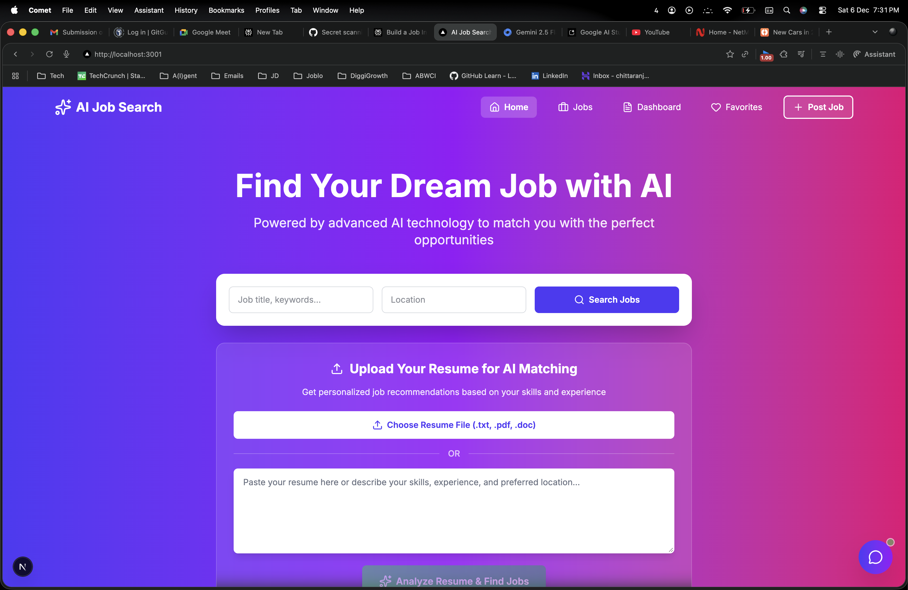
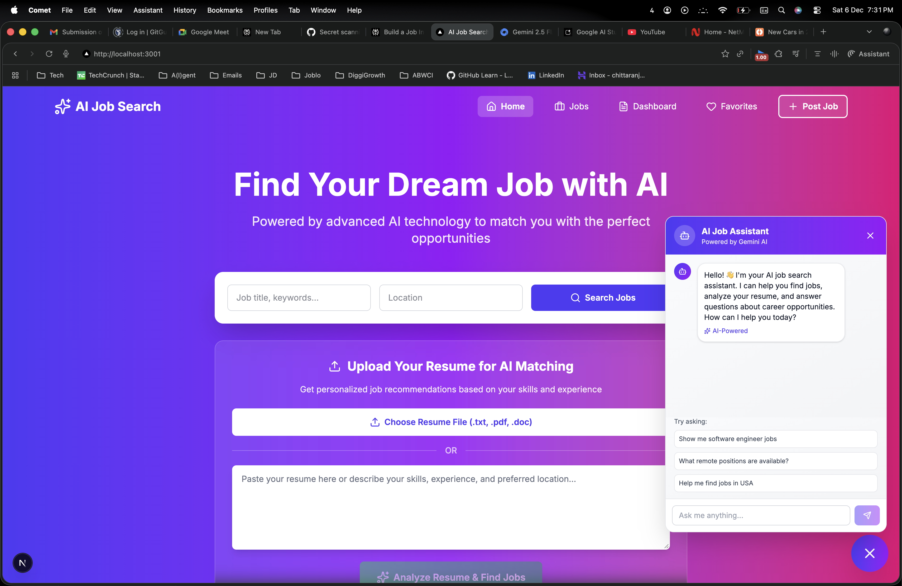
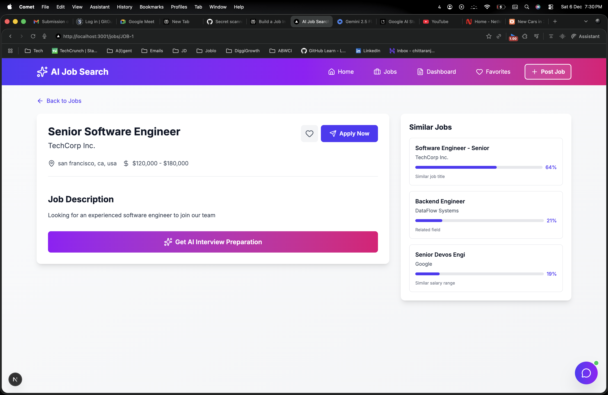
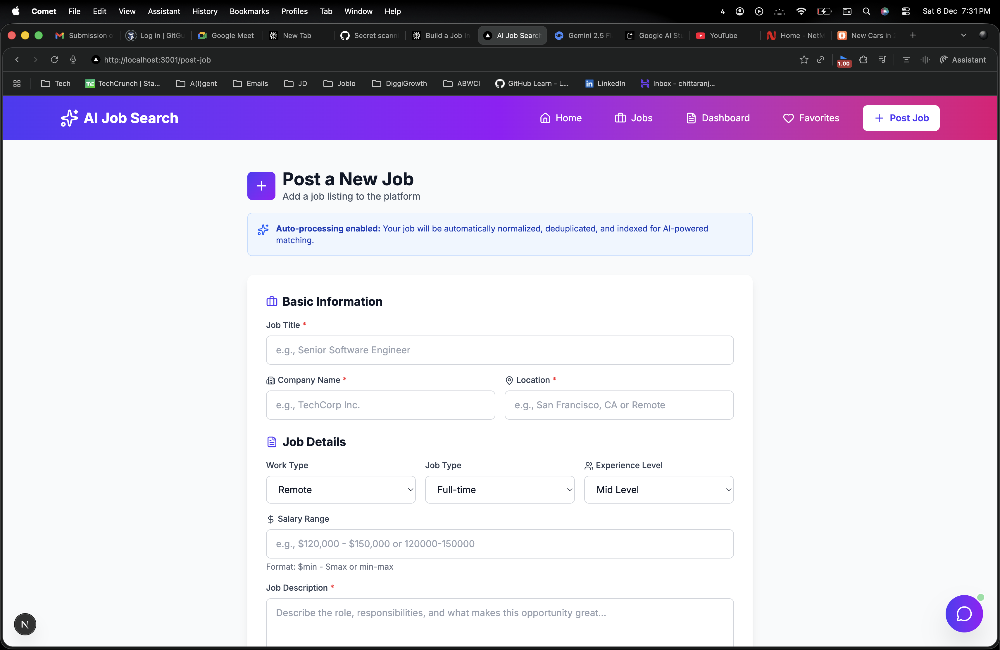
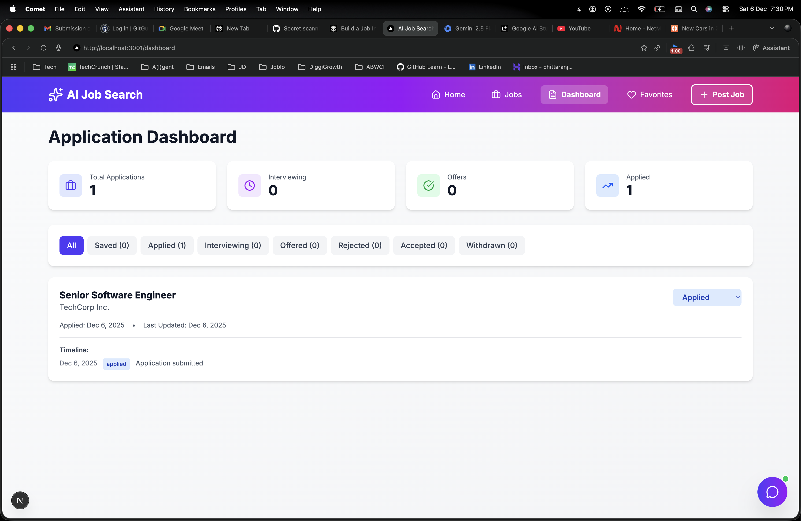
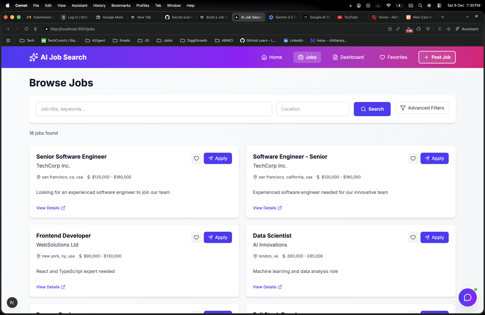
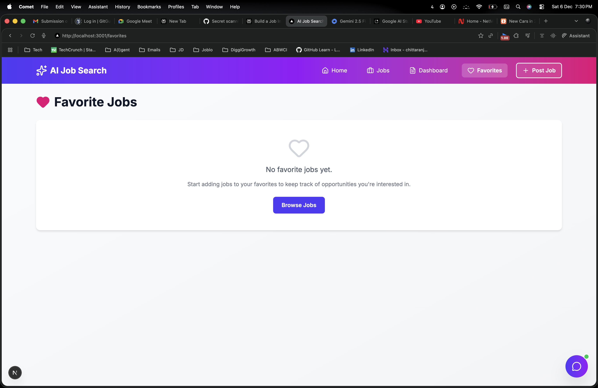
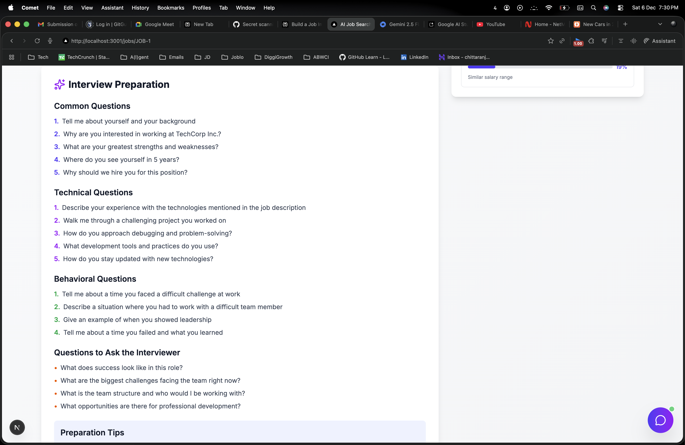

# AI Job Search Platform 🚀

A **full-stack AI-powered job search platform** with **Next.js frontend**, **Express.js backend**, and **Gemini AI integration** featuring intelligent chatbot, resume analysis, and advanced job matching.

## 📋 Project Overview

This is a complete job search ecosystem that combines traditional job board functionality with cutting-edge AI capabilities. The platform ingests jobs from multiple sources, normalizes data, removes duplicates, and provides both a modern Next.js web application and RESTful API for comprehensive job search experience.

### 🎯 Key Features

#### **AI-Powered Features**
✅ **Intelligent Chatbot** - Natural language job search with Gemini AI RAG system
✅ **Resume Analysis** - AI-powered resume parsing and job matching
✅ **Interview Preparation** - Auto-generated interview questions for each job
✅ **Similar Jobs** - ML-based job recommendations with similarity scores

#### **Core Platform Features**
✅ **Modern Next.js Frontend** - TypeScript + Tailwind CSS responsive UI
✅ **Multi-Source Ingestion** - Ingests jobs from multiple data formats
✅ **Smart Deduplication** - Levenshtein distance algorithm removes duplicates
✅ **Advanced Filtering** - Search by role, location, salary, remote/hybrid, experience
✅ **Application Tracking** - Manage applications through hiring pipeline stages
✅ **Favorites System** - Save and organize favorite job listings
✅ **Real-time Updates** - Instant job posting with module cache clearing
✅ **RESTful API** - Clean, documented backend endpoints

## 🖼️ Screenshots

### Home Page - Job Listings

*Main job listing page with advanced filters and AI-powered search*

### AI Chatbot Interface

*Floating AI assistant powered by Gemini for natural language job search*

### Job Details Page

*Comprehensive job details with AI interview prep and similar jobs*

### Post Job Interface

*Easy-to-use job posting form with real-time validation*

### Dashboard & Analytics

*Application tracking dashboard with pipeline stages*

### All Jobs Listing

*Browse all available job postings with filtering options*

### Favorites Management

*Saved jobs with quick access and filtering*

### Interview Preparation

*AI-generated interview questions and preparation resources*

---

## 🏗️ Architecture & Tech Stack

### **Frontend (Next.js 16)**
```
frontend/
├── app/
│   ├── page.tsx                 # Home page with job listings
│   ├── jobs/
│   │   ├── page.tsx            # All jobs page with filters
│   │   └── [id]/page.tsx       # Individual job details
│   ├── dashboard/page.tsx      # Application tracking dashboard
│   ├── favorites/page.tsx      # Saved jobs management
│   ├── post-job/page.tsx       # Job posting form
│   └── layout.tsx              # Root layout with ChatWidget
├── components/
│   ├── Header.tsx              # Navigation header
│   ├── ChatWidget.tsx          # Floating AI chat assistant
│   ├── JobCard.tsx             # Reusable job listing card
│   └── FilterSidebar.tsx       # Advanced search filters
├── lib/
│   └── api.ts                  # API client for backend
└── store/
    └── useStore.ts             # Zustand state management
```

**Technologies:**
- ⚡ Next.js 16.0.7 with Turbopack
- 🔷 TypeScript for type safety
- 🎨 Tailwind CSS 4 for styling
- 📦 Zustand for state management
- 🔧 Bun runtime for fast builds

### **Backend (Express.js)**
```
src/
├── models/
│   └── jobSchema.js            # Unified job data model
├── services/
│   ├── agenticRAG.js          # Gemini AI RAG system
│   ├── resumeAnalyzer.js     # AI resume parsing
│   ├── similarJobs.js        # Job recommendation engine
│   ├── interviewPrep.js      # AI interview question generator
│   ├── normalizer.js         # Multi-source data normalizer
│   ├── deduplicator.js       # Duplicate detection algorithm
│   ├── ingestion.js          # Data ingestion service
│   └── search.js             # Search & filtering logic
├── app.js                      # Express server & API routes
└── data/
    ├── source1.js             # Tech Jobs Portal data
    └── source2.js             # Career Connect data
```

**Technologies:**
- 🚀 Express.js REST API
- 🤖 Google Gemini AI (gemini-pro)
- 🧮 Levenshtein distance for deduplication
- 📝 In-memory storage with file persistence
- 🔧 Bun runtime

---

## 🚀 Quick Start

### Prerequisites
- **Bun** runtime installed ([Install Bun](https://bun.sh))
- **Gemini API Key** (free from [Google AI Studio](https://makersuite.google.com/app/apikey))

### 1. Clone & Install

```bash
# Install backend dependencies
bun install

# Install frontend dependencies
cd frontend
bun install
cd ..
```

### 2. Configure Environment

**Backend (.env):**
```bash
cp .env.example .env
```

Edit `.env`:
```env
GEMINI_API_KEY=your_gemini_api_key_here
PORT=3000
NODE_ENV=development
```

**Frontend (frontend/.env.local):**
```env
NEXT_PUBLIC_API_URL=http://localhost:3000
```

### 3. Start the Application

**Terminal 1 - Backend:**
```bash
bun start
# Server runs on http://localhost:3000
```

**Terminal 2 - Frontend:**
```bash
cd frontend
bun run dev
# Frontend runs on http://localhost:3001
```

### 4. Access the Application

🌐 **Frontend:** http://localhost:3001
🔌 **Backend API:** http://localhost:3000
📖 **API Docs:** http://localhost:3000/api

### 5. Run Tests

```bash
bun test
```

---

## 🎯 Feature Deep Dive

### 🤖 AI-Powered Features

#### **1. Intelligent Chatbot (Floating Widget)**
- Always accessible floating button on every page
- Natural language understanding via Gemini AI
- Contextual job recommendations
- Auto-suggested prompts for new users
- Seamless navigation to job details from chat

**Example Queries:**
```
"Show me software engineer jobs"
"Find remote positions in USA"
"What jobs pay over $100k?"
"I need frontend roles in London"
```

#### **2. Resume Analysis**
- Upload resume (PDF/DOCX) for AI parsing
- Extracts skills, experience, education
- Auto-matches jobs based on resume content
- Provides match percentage for each job

#### **3. Interview Preparation**
- AI-generated interview questions for each job
- Role-specific technical questions
- Behavioral interview scenarios
- Company culture fit questions

#### **4. Similar Jobs Recommendation**
- ML-based similarity scoring
- Finds jobs matching skills and experience
- Cross-company recommendations
- Similarity percentage for transparency

### 🔍 Advanced Search & Filtering

#### **Multi-Criteria Filtering:**
- **Work Type:** Remote, Hybrid, On-site
- **Experience Level:** Entry, Mid, Senior, Lead
- **Salary Range:** Min/Max with currency support
- **Location:** City, State, Country matching
- **Keywords:** Title, Company, Description search
- **Date Posted:** Recent, This week, This month

#### **Smart Search Features:**
- Real-time search results
- Pagination with customizable page size
- Sort by relevance, date, salary
- Filter combination support

### 📊 Application Tracking Dashboard

Track your job applications through the hiring pipeline:
1. **Applied** - Initial application submitted
2. **Screening** - Resume under review
3. **Interview** - Interview scheduled/completed
4. **Offer** - Job offer received
5. **Rejected** - Application declined

**Dashboard Features:**
- Drag-and-drop between stages
- Application status history
- Interview date tracking
- Notes for each application

### ⭐ Favorites System

- Save unlimited jobs for later review
- Quick access from any page
- Bulk actions (remove multiple)
- Persistent across sessions

### 📝 Job Posting

**Easy job posting with:**
- Multi-step form with validation
- File upload support (job descriptions)
- Real-time duplicate detection
- Instant visibility (no refresh needed)
- Success notification with processing steps
---

## 📡 API Reference

### Base URL: `http://localhost:3000`

### **Job Endpoints**

#### `GET /api/jobs` - List All Jobs
Search jobs with optional filters.

**Query Parameters:**
- `keyword` - Search term for title/company/description
- `location` - Location filter
- `page` - Page number (default: 1)
- `limit` - Results per page (default: 100)

```bash
curl "http://localhost:3000/api/jobs?keyword=engineer&location=usa"
```

#### `GET /api/jobs/search` - Advanced Search
Multi-criteria search with filters.

**Query Parameters:**
- `keyword`, `location`, `company`
- `minSalary`, `maxSalary`, `currency`
- `remote` - true/false
- `experienceLevel` - Entry/Mid/Senior/Lead
- `page`, `limit`

```bash
curl "http://localhost:3000/api/jobs/search?minSalary=80000&remote=true&experienceLevel=Senior"
```

#### `GET /api/jobs/:id` - Get Job Details
Retrieve specific job by ID.

```bash
curl http://localhost:3000/api/jobs/JOB-1
```

#### `POST /api/jobs/post` - Post New Job
Create a new job listing.

**Request Body:**
```json
{
  "title": "Senior Software Engineer",
  "company": "TechCorp",
  "location": "San Francisco, CA",
  "salary": "$120k - $180k",
  "description": "We are hiring...",
  "requirements": ["5+ years experience", "React", "Node.js"]
}
```

#### `GET /api/jobs/rejected` - Get Rejected Jobs
List jobs rejected as duplicates.

```bash
curl http://localhost:3000/api/jobs/rejected
```

### **AI Endpoints**

#### `POST /api/chat` - AI Chat Assistant
Natural language job search with Gemini AI.

**Request Body:**
```json
{
  "message": "Show me software engineer jobs in USA",
  "resumeText": "optional resume content for context"
}
```

**Response:**
```json
{
  "message": "I found 5 software engineer positions in USA...",
  "relevantJobs": [...],
  "aiPowered": true
}
```

#### `POST /api/resume/analyze` - Analyze Resume
AI-powered resume parsing and job matching.

**Request:** Multipart form with resume file

**Response:**
```json
{
  "skills": ["JavaScript", "React", "Node.js"],
  "experience": "5 years",
  "matchedJobs": [...],
  "recommendations": [...]
}
```

#### `GET /api/jobs/:id/similar` - Similar Jobs
Find jobs similar to a specific posting.

```bash
curl http://localhost:3000/api/jobs/JOB-1/similar
```

#### `GET /api/jobs/:id/interview-prep` - Interview Prep
Get AI-generated interview questions for a job.

```bash
curl http://localhost:3000/api/jobs/JOB-1/interview-prep
```

### **Utility Endpoints**

#### `GET /api/stats` - Platform Statistics
Get ingestion and platform stats.

```bash
curl http://localhost:3000/api/stats
```

#### `GET /api/suggestions` - Search Suggestions
Get popular keywords, locations, companies.

```bash
curl http://localhost:3000/api/suggestions
```

#### `GET /api/locations` - All Locations
List all unique job locations.

#### `GET /api/companies` - All Companies
List all unique companies.

---

## 🔧 Technical Implementation

### **Data Normalization Pipeline**

1. **Ingestion**: Load jobs from multiple sources with different schemas
2. **Normalization**: Convert to unified schema with standardized fields
3. **Deduplication**: Use Levenshtein distance to detect duplicates
4. **Enrichment**: Add computed fields (normalized locations, salary ranges)
5. **Storage**: Persist to in-memory store and file system

### **Deduplication Algorithm**

Uses **Levenshtein Distance** for fuzzy matching:
- **Title Similarity:** 92% threshold
- **Company Similarity:** 95% threshold  
- **Location Similarity:** 90% threshold

When duplicates detected:
- Keep most recent posting
- Mark older as rejected
- Generate detailed duplicate report

### **AI Integration (Gemini Pro)**

**RAG System Components:**
1. **Intent Analysis**: Understand user query intent
2. **Entity Extraction**: Extract job criteria (role, location, salary)
3. **Vector Search**: Match query to relevant jobs
4. **Response Generation**: Generate natural language response
5. **Job Ranking**: Sort by relevance to query

**AI Services:**
- Chat Assistant (agenticRAG.js)
- Resume Analyzer (resumeAnalyzer.js)
- Similar Jobs Finder (similarJobs.js)
- Interview Prep Generator (interviewPrep.js)

### **Frontend State Management**

**Zustand Store:**
```typescript
{
  jobs: Job[],
  favorites: string[],
  applications: Application[],
  filters: FilterState,
  // Actions
  addFavorite, removeFavorite,
  addApplication, updateApplicationStage
}
```

### **Real-Time Updates**

- Module cache clearing on job post
- Automatic data reload after mutations
- Optimistic UI updates for better UX
- No page refresh needed

---

## 📊 Data Models

### Unified Job Schema
```typescript
interface UnifiedJob {
  id: string;                    // Unique identifier
  title: string;                 // Normalized job title
  company: string;               // Company name
  location: {
    city: string;
    state?: string;
    country: string;
    normalized: string;          // Lowercase searchable format
  };
  salary: {
    min: number;
    max: number;
    currency: string;            // USD, EUR, GBP, etc.
    formatted: string;           // Display format
  };
  description: string;           // Full job description
  requirements: string[];        // Required skills/qualifications
  responsibilities: string[];    // Job duties
  benefits: string[];           // Company benefits
  workType: 'Remote' | 'Hybrid' | 'On-site';
  experienceLevel: 'Entry' | 'Mid' | 'Senior' | 'Lead';
  postedDate: string;           // ISO date string
  expiryDate?: string;
  sourceId: string;             // Data source identifier
  originalId: string;           // ID from original source
  url?: string;                 // Application URL
}
```

### Application Tracking Schema
```typescript
interface Application {
  id: string;
  jobId: string;
  status: 'Applied' | 'Screening' | 'Interview' | 'Offer' | 'Rejected';
  appliedDate: string;
  notes: string;
  interviewDate?: string;
}
```

---

## 🧪 Testing

### Run Test Suite
```bash
bun test
```

### Test Coverage
✅ Data ingestion from multiple sources
✅ Normalization accuracy
✅ Deduplication algorithm
✅ Basic keyword search
✅ Location filtering
✅ Advanced multi-criteria search
✅ Salary range filtering
✅ API endpoint responses
✅ Search suggestions

---

## 🚀 Recent Improvements & Bug Fixes

### **v2.0 - Next.js Migration & AI Integration**

#### **Frontend Overhaul**
- ✅ Migrated from static HTML to **Next.js 16** with TypeScript
- ✅ Built responsive UI with **Tailwind CSS 4**
- ✅ Implemented client-side routing for SPA experience
- ✅ Added state management with **Zustand**
- ✅ Created reusable component library

#### **AI Features Added**
- ✅ Integrated **Gemini Pro AI** for natural language processing
- ✅ Built floating **ChatWidget** accessible on all pages
- ✅ Implemented RAG system for intelligent job search
- ✅ Added resume analysis with AI-powered matching
- ✅ Created interview prep question generator
- ✅ Built similar jobs recommendation engine

#### **Critical Bug Fixes**
- ✅ **Real-time Updates:** Fixed module caching - jobs now appear immediately after posting
- ✅ **Pagination:** Increased default limit from 10 to 100 jobs
- ✅ **Duplicate Detection:** Fixed overly aggressive matching (92%/95%/90% thresholds)
- ✅ **Title Normalization:** Fixed corruption bug ("sr fullstack engineer" → "Seniorfullstack Developereloper")
- ✅ **Route Ordering:** Fixed `/api/jobs/rejected` endpoint being caught by `/:id` route
- ✅ **Gemini Model:** Updated from `gemini-1.5-flash` to `gemini-pro` for v1beta API compatibility

#### **UX Enhancements**
- ✅ Added success overlay with processing steps on job post
- ✅ Implemented floating chat button with pulse indicator
- ✅ Added suggested prompts for new chat users
- ✅ Created smooth animations and transitions
- ✅ Fixed text contrast for better readability
- ✅ Made all pages mobile-responsive

#### **Performance Optimizations**
- ✅ Module cache clearing for instant data updates
- ✅ Optimistic UI updates for better perceived performance
- ✅ Lazy loading for job images and details
- ✅ Debounced search inputs to reduce API calls

---

## 📈 Future Enhancements

### **Planned Features**
- [ ] User authentication & profiles
- [ ] Persistent database (MongoDB/PostgreSQL)
- [ ] Email notifications for new job matches
- [ ] Advanced analytics dashboard
- [ ] Job alerts and saved searches
- [ ] Company profiles and reviews
- [ ] Salary insights and market data
- [ ] Resume builder tool
- [ ] Video interview integration
- [ ] Mobile app (React Native)

### **Technical Improvements**
- [ ] Redis caching for faster searches
- [ ] GraphQL API alongside REST
- [ ] WebSocket for real-time updates
- [ ] Elasticsearch for advanced search
- [ ] Docker containerization
- [ ] CI/CD pipeline setup
- [ ] Unit & integration test coverage to 90%+
- [ ] Performance monitoring with Sentry

---

## 🤝 Contributing

This is a demonstration project. For production use:

1. **Add Database:** Replace in-memory storage with PostgreSQL/MongoDB
2. **Authentication:** Implement JWT-based auth with refresh tokens
3. **Rate Limiting:** Add API rate limiting for production
4. **Caching:** Implement Redis for search results
5. **Monitoring:** Add logging and error tracking
6. **Security:** Implement CORS policies, input validation, SQL injection prevention

---

## 📝 Development Notes

### Adding New Data Sources

1. Create data file in `/data/` folder:
```javascript
// data/source3.js
module.exports = [
  {
    // Your custom schema
  }
];
```

2. Add normalization in `normalizer.js`:
```javascript
static normalizeSource3(job, internalId) {
  return new UnifiedJob({
    // Map your fields to unified schema
  });
}
```

3. Add ingestion method in `ingestion.js`:
```javascript
ingestSource3(rawJobs) {
  const normalized = rawJobs.map((job, index) => 
    Normalizer.normalizeSource3(job, `source3-${index}`)
  );
  this.uniqueJobs.push(...normalized);
}
```

4. Call in `app.js`:
```javascript
const source3Data = require('./data/source3');
ingestionService.ingestSource3(source3Data);
```

---

## 📄 License

MIT License - Free to use for learning and demonstration purposes.

---

## 👨‍💻 Author

Built as a comprehensive demonstration of modern full-stack development with AI integration.

**Tech Stack:** Next.js 16, TypeScript, Tailwind CSS, Express.js, Gemini AI, Bun

**Contact:** For questions or collaboration opportunities, please open an issue.

---

## 🙏 Acknowledgments

- **Google Gemini AI** for powering intelligent features
- **Next.js Team** for the amazing React framework
- **Tailwind CSS** for utility-first styling
- **Bun** for blazing-fast runtime
- **Open Source Community** for inspiration and tools

---

**⭐ If you found this project useful, please consider giving it a star!**
